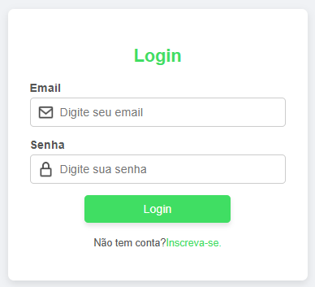
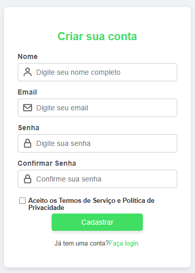

# Tela-de-login-e-cadastro

Este projeto é um sistema de autenticação simples, desenvolvido em React, que inclui telas de login e cadastro com validações e integração com backend. O objetivo é criar uma interface de usuário intuitiva e funcional, onde os usuários possam se registrar e fazer login de maneira eficiente.

## Funcionalidades

- Tela de Login com validação de email e senha.
- Tela de Cadastro com validação de nome, email, senha e confirmação de senha.
- Integração com API de backend para autenticação.
- Exibição de mensagens de erro em tempo real.
- Checkbox para aceitar os Termos de Serviço e Política de Privacidade.

## Tecnologias Utilizadas

- **React.js** para o desenvolvimento da interface de usuário.
- **React Router** para navegação entre páginas.
- **CSS** para estilização customizada.
- **Fetch API** para comunicação com o backend.

## Como rodar o projeto

### Pré-requisitos
- Node.js instalado

### Instalação

1. Clone o repositório:
    ```bash
    git clone https://github.com/seu-usuario/Tela-de-login-e-cadastro.git
    ```

2. Acesse o diretório do projeto:
    ```bash
    cd sistema-autenticacao
    ```

3. Instale as dependências:
    ```bash
    npm install
    ```

4. Rode o projeto:
    ```bash
    npm run dev
    ```

O sistema estará disponível em `http://localhost:3000`.

## Screenshots

### Tela de Login


### Tela de Cadastro


## Contribuição

Contribuições são bem-vindas! Sinta-se à vontade para abrir issues ou enviar pull requests.

## Licença

Este projeto está licenciado sob a MIT License - veja o arquivo [LICENSE](LICENSE) para mais detalhes.
